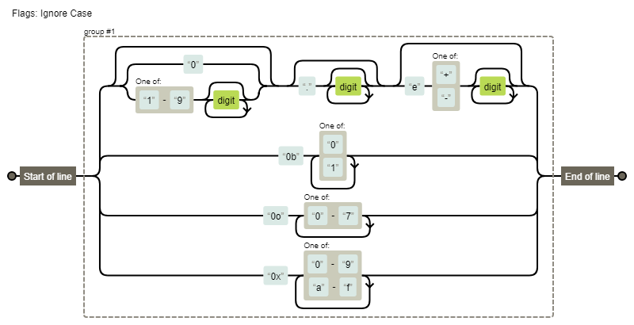

[TOC]

# 每周总结可以写在这里

### 作业

| 题目                   | 分析地址         | 实现地址              |
| ---------------------- | ---------------- | --------------------- |
| 带括号四则运算的产生式 | Arithmetic.md    | Arithmetic.md         |
| utf8 encode            | Unicode.md       | /type/utf-8_encode.js |
| 字符直接量正则         | StringLiteral.md | -                     |
| 数字直接量正则         | NumberLiteral.md | /type/number.js       |


### 动态与静态

|          | 运行位置                  | 运行时         | 名称        |
| -------- | ------------------------- | -------------- | ----------- |
| 动态语言 | 在用户的设备/在线服务器上 | 产品实际运行时 | Runtime     |
| 静态语言 | 在程序员的设备上          | 产品开发时     | Compiletime |

### 类型系统

- 动态类型系统与静态类型系统

- 强类型与弱类型 区别有无隐式转换

- 复合系统
  - 结构体
  - 函数签名
- 子类型
  - 协变/逆变


### 模拟四则运算步骤

1.  定义四则运算产生式
2.  词法分析
3.  语法分析
4.  解释执行

#### 定义四则运算产生式

1. 把减法看作特殊的加法
1 - 1 => 1 + -1
2. 把四则运算中，因为“+”，“-”的优先级比“*”，“/”，”()“低，所以计算的最终结果可以看作加法运算，把"*"，"/"，"()"的表达式看作一个整体数。

无括号四则运算
```
<Number> ::= "0" | "1" | ... | "9"
<DecimalNumber> ::= "0" | (("1" | "2" | ... | "9") <Number>*)
<Expression> ::= <AdditiveExpression>
<AdditiveExpression> ::= <MulitiplicationExpression> |
	<DecimalNumber> "+" <AdditiveExpression> |
	<DecimalNumber> "-" <AdditiveExpression>
<MulitiplicationExpression> ::= <DecimalNumber> |
	<DecimalNumber> "*" <MulitiplicationExpression> |
	<DecimalNumber> "/" <MulitiplicationExpression>
```

有括号四则运算

```
<PrimaryExpression> ::= <DecimalNumber> | "(" <AdditiveExpression> ")""
<AdditiveExpression> ::= <MulitiplicationExpression> |
	<DecimalNumber> "+" <AdditiveExpression> |
	<DecimalNumber> "-" <AdditiveExpression>
<MulitiplicationExpression> ::= <PrimaryExpression> |
	<PrimaryExpression> "*" <MulitiplicationExpression> |
	<PrimaryExpression> "/" <MulitiplicationExpression>
```

### Number

- 语法

  - 十进制

  - 二进制

  - 八进制

  - 十六进制

- 运行时

  - 遵循IEEE754 双精度64位存储数字

#### 正则能匹配所有Number的直接量

NumbericLiteral ::

```
//此为推算过程，写得比较随性

在严格模式下

DecimalIntegerLiteral = 0|[1-9][0-9]*

DecimalLiteral = (0|[1-9][0-9]+ \. \d* e[\+\-]\d* )

  | ( \. \d+ e[\+\-]\d* )

  | (0|[1-9][0-9]+ e[\+\-]\d*)

 = (0|([1-9]\d)*)(\.(\d*))?(e[\+\-]\d*)?

BinaryIntegerLiteral = 0b[01]+

OctalIntegerLiteral = 0o[0-7]+

HexIntegerLiteral = 0x[0-9a-f]+

非严格模式下

NonOctalDecimalIntegerLiteral = 0|[89]\d+

  | 0[0-7]+\d+

```



#### 总结

数组直接量
在严格模式下只有4中语法：- 十进制、二进制(0b 0B)、八进制(0o 0O)、十六进制(0x 0X), 而且不允许0开头的数字，否则程序会报错
在非严格模式在，以0开头的数字的情况(排除0x,0o,0b)：
1. 后面的数字都是小于8，程序认为是八进制数
2. 后面的数字至少有一个数字大于等于8，则认为是10进制数返回忽略前面0的数


#### 实现

在/type/number.js中实现了在**严格模式下**正则能匹配所有Number的直接量

在/type下 执行`npm run test:number`，可以执行number.js的测试用例

参考：ecma-262 10th

### Unicode

#### UTF-8

**UTF-8 是 Unicode 的实现方式之一**

UTF-8 最大的一个特点，就是它是一种变长的编码方式。它可以使用1~4个字节表示一个符号，根据不同的符号而变化字节长度。

[UTF-8, a transformation format of ISO 10646](https://www.ietf.org/rfc/rfc3629.txt)

| Unicode符号范围(十六进制) | UTF-8编码方式（二进制）             | 字符个数 |
| :------------------------ | ----------------------------------- | :------: |
| 0000 0000-0000 007F       | 0xxxxxxx                            |    1     |
| 0000 0080-0000 07FF       | 110xxxxx 10xxxxxx                   |    2     |
| 0000 0800-0000 FFFF       | 1110xxxx 10xxxxxx 10xxxxxx          |    3     |
| 0001 0000-0010 FFFF       | 11110xxx 10xxxxxx 10xxxxxx 10xxxxxx |    4     |

#### UTF-8 encode

将字符编码为UTF-8的过程如下：

1. 根据上表的第一列的范围，确定字符的字节个数，
2. 根据上表的第二列，把固定的字节确定好，
3. 字符的二进制按从左往右填充x的位置。

> 注意：UTF-8禁止编码U+D800到U+DFFF之间的Unicode，用来作为UTF-16的代理对编码

#### UTF-16

[https://tools.ietf.org/html/rfc2781](https://tools.ietf.org/html/rfc2781)

它的编码规则很简单：基本平面的字符占用2个字节，辅助平面的字符占用4个字节。也就是说，UTF-16的编码长度要么是2个字节（U+0000到U+FFFF），要么是4个字节（U+010000到U+10FFFF）。

具体来说，辅助平面的字符位共有220个，也就是说，对应这些字符至少需要20个二进制位。UTF-16将这20位拆成两半，前10位映射在U+D800到U+DBFF（空间大小210），称为高位（H），后10位映射在U+DC00到U+DFFF（空间大小210），称为低位（L）。这意味着，一个辅助平面的字符，被拆成两个基本平面的字符表示。

#### decodeing UTF-16

首先设 w<sub>1</sub>是16位数，w<sub>2</sub>是 w<sub>1</sub>下一个16位数

1. w<sub>1</sub> 小于0xD800 或者 大于 0xDFFF, 则该字符的值是w<sub>1</sub>的值，终止。

2. w<sub>1</sub>如果不在0xD800和0xDBFF之间，该序列是错误的，使用w<sub>1</sub>不用对应的有效的字符，终止
3. 如果没有w<sub>2</sub>的值，或者w<sub>2</sub>的值不在0xDC00和0xDFFF之间，那么该序列发送错误，终止。
4. 构造一个20位无字符数U， 低位(后10位)是w<sub>1</sub>的值，高位(前10位)是w<sub>2</sub>的值。
5. 然后U加上0x10000，得到的值是该字符值，终止

#### encoding UTF-16

Unicode编码为UTF-16

```
H = Math.floor((c-0x10000)/0x400)+0xD800
  = c >> 10 + 0xD800

L = (c-0x10000) % 0x400+0xDC00
  = c & 0x03FF + 0xDC00
```


#### USC2与UTF-16

两者的关系简单说，就是UTF-16取代了UCS-2，或者说UCS-2整合进了UTF-16。所以，现在只有UTF-16，没有UCS-2

#### 实现 UTF-8 encode

根据以上的知识，实现在`/type/utf-8_encode.js`

执行测试用例在`/type`下，现在下载好依赖`npm i`, 然后再在`npm run test:utf8`


参考：

[Unicode与JavaScript详解](https://www.ruanyifeng.com/blog/2014/12/unicode.html)

[字符编码笔记：ASCII，Unicode 和 UTF-8](http://www.ruanyifeng.com/blog/2007/10/ascii_unicode_and_utf-8.html)

[通过javascript进行UTF-8编码](https://segmentfault.com/a/1190000005794963#item-1)

https://segmentfault.com/a/1190000005794963

http://www.huangwenchao.com.cn/2015/09/javascript-utf8-encoding.html

https://gist.github.com/pascaldekloe/62546103a1576803dade9269ccf76330

JavaScript是什么编码的 https://mathiasbynens.be/notes/javascript-encoding

