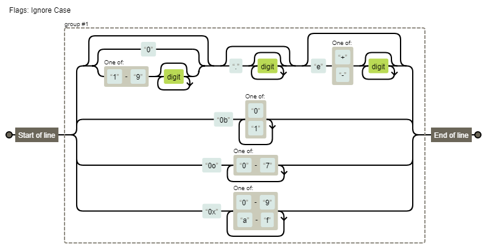

[TOC]

### Number

- 语法

  - 十进制

  - 二进制

  - 八进制

  - 十六进制

- 运行时

  - 遵循IEEE754 双精度64位存储数字

#### 正则能匹配所有Number的直接量

NumbericLiteral ::

```
//此为推算过程，写得比较随性

在严格模式下

DecimalIntegerLiteral = 0|[1-9][0-9]*

DecimalLiteral = (0|[1-9][0-9]+ \. \d* e[\+\-]\d* )

  | ( \. \d+ e[\+\-]\d* )

  | (0|[1-9][0-9]+ e[\+\-]\d*)

 = (0|([1-9]\d)*)(\.(\d*))?(e[\+\-]\d*)?

BinaryIntegerLiteral = 0b[01]+

OctalIntegerLiteral = 0o[0-7]+

HexIntegerLiteral = 0x[0-9a-f]+

非严格模式下

NonOctalDecimalIntegerLiteral = 0|[89]\d+

  | 0[0-7]+\d+

```



#### 总结

数组直接量
在严格模式下只有4中语法：- 十进制、二进制(0b 0B)、八进制(0o 0O)、十六进制(0x 0X), 而且不允许0开头的数字，否则程序会报错
在非严格模式在，以0开头的数字的情况(排除0x,0o,0b)：
1. 后面的数字都是小于8，程序认为是八进制数
2. 后面的数字至少有一个数字大于等于8，则认为是10进制数返回忽略前面0的数


#### 实现

在/type/number.js中实现了在**严格模式下**正则能匹配所有Number的直接量

在/type下 执行`npm run test:number`，可以执行number.js的测试用例

参考：ecma-262 10th